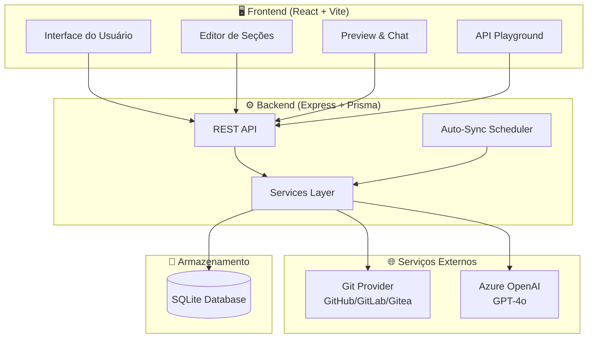
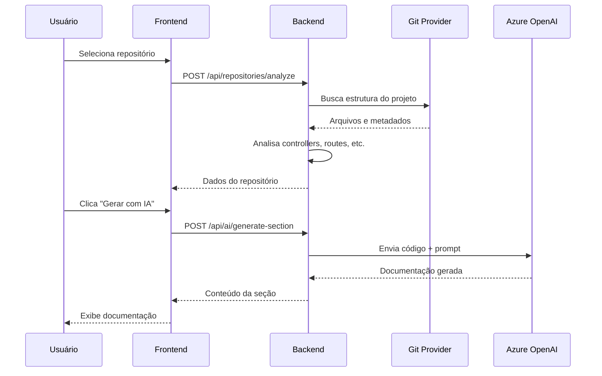
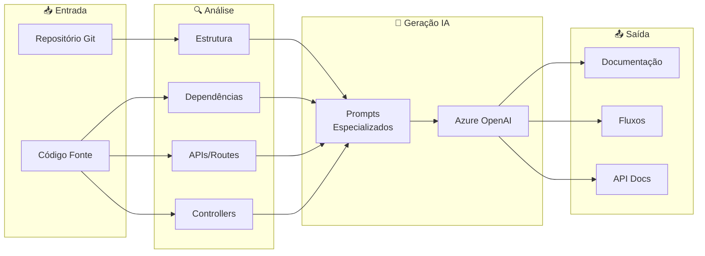
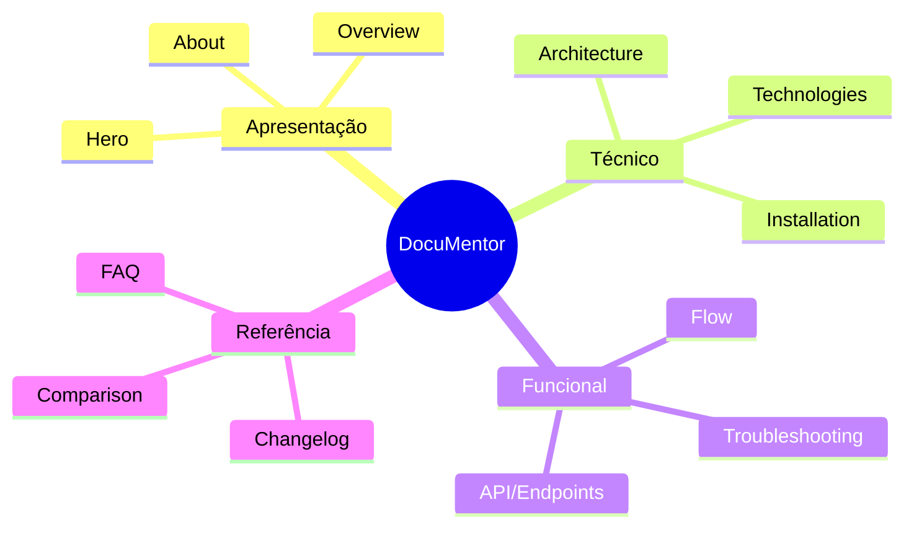
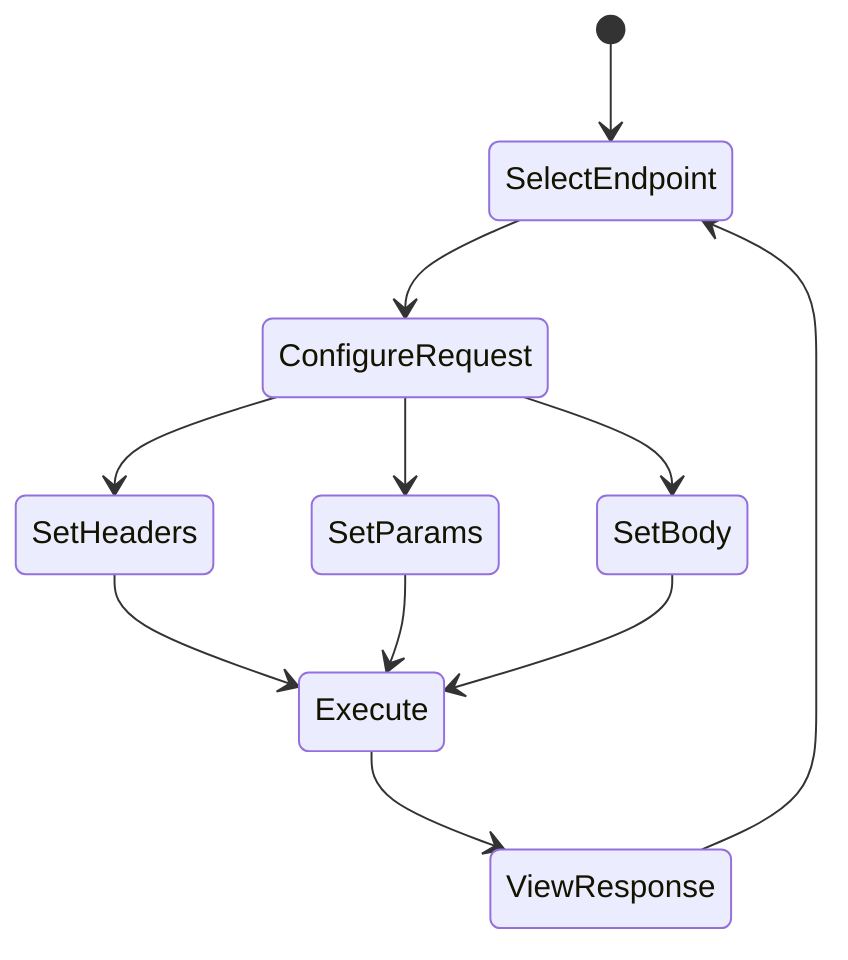
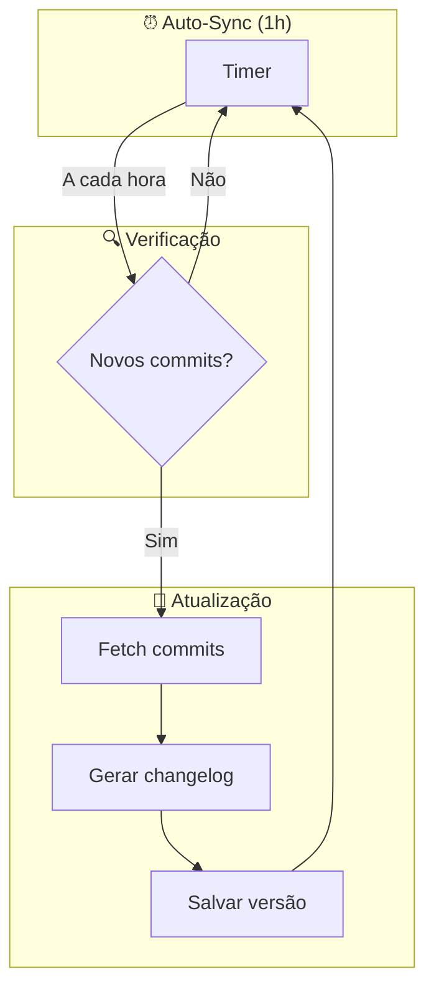
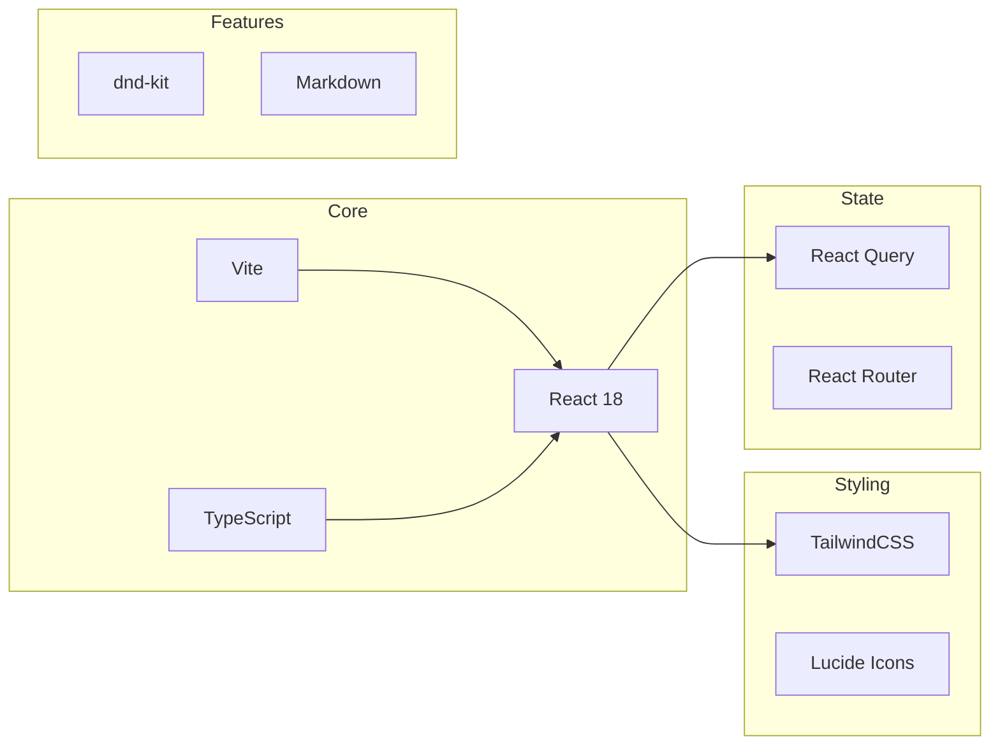
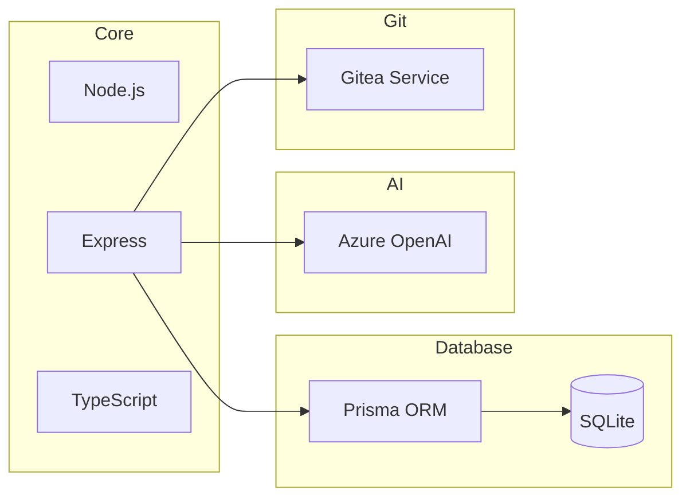
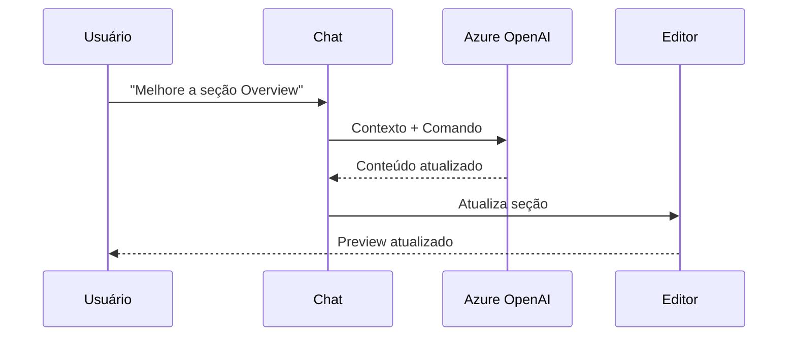
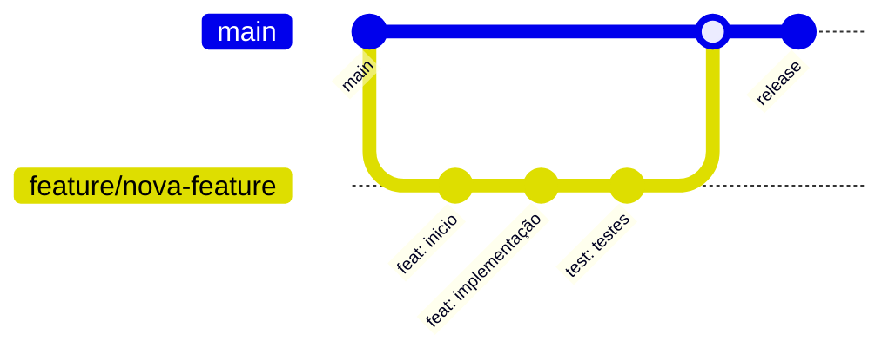

# DocuMentor 📚

> Sistema inteligente de geração de documentação técnica com IA.


## 🎯 Visão Geral

O **DocuMentor** é uma plataforma completa que automatiza a criação de documentação técnica de alta qualidade. Utilizando IA avançada (Azure OpenAI ou Anthropic Claude), o sistema analisa código fonte e gera documentação visual profissional.

### ✨ Principais Funcionalidades

- 🔗 **Integração com Git** - Suporta GitHub, GitLab, Gitea e outros
- 🤖 **IA Generativa** - Analisa código e gera documentação contextualizada
- 🎨 **Templates Visuais** - Documentação profissional e customizável
- 💬 **Chat com IA** - Edição em tempo real via conversação
- 📄 **Export HTML** - Páginas standalone prontas para uso
- 💾 **Versionamento** - Armazenamento e histórico de todas as versões
- 🌙 **Modo Escuro** - Interface adaptável com tema claro/escuro
- 📦 **Publicações por Categoria** - Organize e compartilhe documentação
- 🔄 **Sincronização Git** - Auto-sync com commits e release notes
- 🔌 **API Playground** - Teste endpoints estilo Swagger UI

## 🏗️ Arquitetura do Sistema

### Diagrama de Componentes



### Fluxo de Dados



## 📁 Estrutura do Projeto

```
DocuMentor/
├── packages/
│   ├── frontend/              # React 18 + Vite + TailwindCSS
│   │   ├── src/
│   │   │   ├── components/    # Componentes reutilizáveis
│   │   │   │   └── documentation/  # Seções de documentação
│   │   │   ├── contexts/      # ThemeContext (dark mode)
│   │   │   ├── pages/         # Páginas da aplicação
│   │   │   ├── services/      # API clients (Axios)
│   │   │   └── types/         # TypeScript types
│   │   └── ...
│   │
│   ├── backend/               # Node.js + Express + Prisma
│   │   ├── src/
│   │   │   ├── routes/        # Rotas da API REST
│   │   │   ├── services/      # Lógica de negócio
│   │   │   └── integrations/  # Claude AI, Gitea
│   │   ├── prisma/
│   │   │   └── schema.prisma  # Schema do banco
│   │   └── ...
│   │
│   └── mcp-server/            # MCP Server para Gitea
│
├── modelo-exemplo/            # Exemplo de documentação gerada
├── .env.example               # Template de variáveis
└── README.md
```

## 🔄 Fluxo de Geração de Documentação



## 🚀 Quick Start

### Pré-requisitos

- **Node.js** 18+
- **npm** ou **yarn**
- Acesso a um servidor Git (GitHub, GitLab, Gitea)
- Credenciais **Azure OpenAI** ou **Anthropic API**

### Instalação

```bash
# 1. Clone o repositório
git clone https://github.com/leonardo-matheus/DocuMentor.git
cd DocuMentor

# 2. Instalar dependências
npm install

# 3. Configurar variáveis de ambiente
cp .env.example packages/backend/.env
# Edite packages/backend/.env com suas credenciais

# 4. Inicializar banco de dados
cd packages/backend
npx prisma generate
npx prisma db push
cd ../..

# 5. Iniciar em modo desenvolvimento
npm run dev
```

### 🌐 URLs da Aplicação

| Serviço | URL |
|---------|-----|
| Frontend | http://localhost:5173 |
| Backend API | http://localhost:3001/api |
| Publicações Públicas | http://localhost:5173/docs/:slug |
| Health Check | http://localhost:3001/health |

## ⚙️ Configuração

### Variáveis de Ambiente

```env
# Git Provider
GITEA_URL=https://github.com
GITEA_TOKEN=seu_token_aqui

# Azure OpenAI
AZURE_OPENAI_ENDPOINT=https://seu-recurso.openai.azure.com
AZURE_OPENAI_API_KEY=sua_chave_aqui
AZURE_OPENAI_DEPLOYMENT=o1
AZURE_OPENAI_API_VERSION=2024-12-01-preview

# Database
DATABASE_URL=file:./prisma/documentor.db

# Server
PORT=3001
FRONTEND_URL=http://localhost:5173
```

## 🎨 Seções de Documentação

O sistema gera documentação modular com as seguintes seções:



| Tipo | Descrição | Geração IA |
|------|-----------|------------|
| `hero` | Banner de abertura | ✅ |
| `overview` | Visão geral do projeto | ✅ |
| `about` | Sobre o sistema | ✅ |
| `architecture` | Arquitetura e diagramas | ✅ |
| `technologies` | Stack tecnológica | ✅ |
| `installation` | Guia de instalação | ✅ |
| `flow` | Fluxos baseados no código | ✅ |
| `api` | Documentação Swagger-like | ✅ |
| `troubleshooting` | Problemas e soluções | ✅ |
| `faq` | Perguntas frequentes | ✅ |
| `changelog` | Release Notes (Git sync) | ✅ |

## 🔌 API Playground

O DocuMentor inclui um playground de APIs estilo Swagger UI:



### Funcionalidades:
- 🎯 **Agrupamento por Tags** - Endpoints organizados por categoria
- 📝 **Editor de Request** - Headers, Query Params, Body
- 🔐 **Autenticação** - Suporte a Bearer Token, API Key
- 📊 **Response Viewer** - Formatação JSON com syntax highlight
- ⚡ **Try It Out** - Execute requests direto da documentação

## 🔄 Sincronização Git

### Auto-Sync com Release Notes



### Configurações de Sync:
- **Branch selecionável** com busca/filtro
- **Auto-sync** configurável (1h por padrão)
- **Histórico de commits** com diff view
- **Release notes** geradas automaticamente

## 🧪 Stack Tecnológica

### Frontend



### Backend



## 💬 Chat com IA

O DocuMentor possui um chat integrado com IA:



**Comandos de exemplo:**
```
"Melhore a descrição da seção Overview"
"Adicione mais 3 perguntas no FAQ sobre segurança"
"Corrija o diagrama de arquitetura"
"Gere fluxos baseados nos controllers"
```

## 🔧 API Reference

### Projetos

| Método | Endpoint | Descrição |
|--------|----------|-----------|
| GET | `/api/projects` | Listar projetos |
| GET | `/api/projects/:id` | Obter projeto |
| POST | `/api/projects` | Criar projeto |
| PUT | `/api/projects/:id` | Atualizar projeto |
| DELETE | `/api/projects/:id` | Remover projeto |
| GET | `/api/projects/:id/sync` | Status de sincronização |
| POST | `/api/projects/:id/sync` | Sincronizar com Git |
| GET | `/api/projects/:id/sync/settings` | Configurações de sync |
| PUT | `/api/projects/:id/sync/settings` | Atualizar sync settings |

### Publicações

| Método | Endpoint | Descrição |
|--------|----------|-----------|
| GET | `/api/publications` | Listar publicações |
| POST | `/api/publications` | Criar publicação |
| PUT | `/api/publications/:id` | Atualizar publicação |
| DELETE | `/api/publications/:id` | Remover publicação |
| GET | `/api/publications/view/:slug` | Visualizar pública |

### IA

| Método | Endpoint | Descrição |
|--------|----------|-----------|
| GET | `/api/ai/status` | Status da conexão IA |
| POST | `/api/ai/chat` | Chat simples |
| POST | `/api/ai/chat-edit` | Chat com edição |
| POST | `/api/ai/generate-section` | Gerar seção |

### Repositórios

| Método | Endpoint | Descrição |
|--------|----------|-----------|
| POST | `/api/repositories/analyze` | Analisar repositório |
| GET | `/api/repositories` | Listar repositórios |
| GET | `/api/repositories/:owner/:repo/branches` | Listar branches |

## 📝 Contribuindo



1. Crie uma branch: `git checkout -b feature/nova-feature`
2. Faça suas alterações
3. Commit: `git commit -m 'feat: descrição da feature'`
4. Push: `git push origin feature/nova-feature`
5. Abra um Pull Request

### Convenção de Commits

| Prefixo | Descrição |
|---------|-----------|
| `feat` | Nova funcionalidade |
| `fix` | Correção de bug |
| `docs` | Documentação |
| `style` | Formatação |
| `refactor` | Refatoração |
| `test` | Testes |
| `chore` | Manutenção |

## 🔐 Segurança

> ⚠️ **IMPORTANTE**: Nunca commite arquivos `.env` com credenciais reais!

- Use `.env.example` como template
- Adicione credenciais apenas no `.env` local
- O `.gitignore` já protege arquivos `.env`

## 📄 Licença

MIT License - Veja [LICENSE](LICENSE) para detalhes.

---

<p align="center">
  Feito com ❤️ por Leonardo Matheus
</p>
